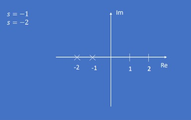

# CLASIFICACION DE LAS FUNCIONES DE TRANSFERENCIA 

Una funcion de transferencia se puede expresar como: 

$$ G(s) = \frac{N(s)}{D(s)} $$

Donde N(s) Y D(s) son polinomios de variable "s".

Si denominamos n al grado del polimonio del numerador.

Si denominamos m al grado del polimonio del denominador.

Se tiene 3 cosas posibles: 
- n > m    Impropia 
- m > n    Estrictamente propia 
- n = m    Bipropia

## EJEMPLO DE LA CLASE 

$$ G(s) = \frac{s^{2} + 1}{s} = Impropia $$

$$ G(s) = 2 = Bipropia $$                     

$$ G(s) = \frac{1}{s + 1} = Estrictamente propia $$         

$$ G(s) = \frac{(s^{2} - 1)}{s + 1} =  Impropia $$    

$$ G(s) = \frac{s - 1}{s + 1} = Bipropia $$         

## EJEMPLO POR TEMA 

$$ G(s) = \frac{5}{2s + 1} = Estrictamente propia $$               

$$ G(s) = \frac{25}{s^{2} + 4s + 25} = Estrictamente propia $$       

$$ G(s) = \frac{2s + 3}{s + 5} = Bipropia $$            

$$ G(s) = \frac{s^{2} + 1}{s^{2} + 3s + 2} = Bipropia $$   

$$ G(s) = \frac{s^{2} + 2s + 1}{s + 1} = Impropia $$       

$$ G(s) = \frac{s^{3} + 2s + 1}{s^{2} + s + 1} = Impropia $$  

# ZEROS DE UNA FUNCION DE TRANSFERENCIA 

Si se igual N(S) a 0 se obtienen lo valores de "S" que cumple con la condicion

Si el numerador se hace 0 toda la funcion de transferencia se vuelve cero de ahi el nombre para estos valores de "s"

Estos valores pueden ser reales o complejos por lo tanto se puede ubicar en un plano cartesino 

## EJEMPLO DE LA CLASE

1.

$$ G(s) = \frac{Y(s)}{U(s)} = \frac{3s - 1}{s^{2} + 3s + 1} = \frac{N(s)}{D(s)} $$

$$ N(s) = 0 $$   

$$ 3s - 1 = 0 $$

$$ s = \frac{1}{3} $$ 

## UBICACION DE ZEROS

2.

$$ G(s) = \frac{s^{2} + 4s + 1}{s^{4} + 3s^{3} + 3s^{2} + s + 2} $$

$$ s^{2} + 4s + 1 = 0 $$

Se resulve por ecuacion cuadratica 

$$ s = \frac{- b\pm \sqrt{b^{2} - 4ac}}{2a} $$

Se reemplaza 

$$ s = \frac{- 4\pm \sqrt{4^{2} - 4(1)(1)}}{2(1)} $$

Se Soluciona 

$$ s = \frac{- 4\pm \sqrt{16 - 4}}{2} $$

$$ s = - 2\pm \frac{\sqrt{12}}{2} $$

$$ s = - 2\pm \frac{2\sqrt{3}}{2} $$

Se cancelan los 2 

$$ s = - 2 \pm \sqrt{3} $$

Solucion 1

$$ s = - 2 + \sqrt{3} $$

Solucion 2

$$ s = -2 - \sqrt{3} $$

## EJEMPLO POR TEMA

1.

$$ G(s) = \frac{s + 3}{s^{3} + 4s + 5} $$

$$ s + 3 = 0 \Rightarrow s = -3 $$

2.

$$ G(s) = \frac{s^{2} + 2s + 1}{s^{2} + 3s + 2} $$

El numerdor es un trinomio cuadrado

$$ s^{2} - 2s + 1 = (s - 1)^{2} $$

$$ s = 1 (multiplicidad 2) $$

# POLOS DE UNA FUNCION DE TRANSFERENCIA 

Si se iguala D(s) a 0 se obtiene los valores de "s" que cumplen con la condicion .

Si el denominador se hace 0 toda la funcion de transferencia se vuelve infinito de ahi el nombre para valores de "s".

Estos valores pueden ser reales o complejos por lo tanto se pueden en un plano cartisiano.

## EJEMPLOS DE LA CLASE

$$ G(s) = \frac{Y(s)}{U(s)} = \frac{3s - 1}{s^{2} + 3s + 2} = \frac{N(s)}{D(s)} $$

POLOS

$$ D(s) = 0 $$

$$ s^{2} + 3s + 2 = 0 $$

$$ (s + 1)(s + 2) = 0 $$

$$ s = -1 $$

$$ s = -2 $$

## UBICACION DE POLOS

## UBICACION GENERAL DE POLOS Y ZEROS 

## EJEMPLOS DE LA CLASE

POLOS

1.

$$ s^{2} + 0.5s + 1 $$

-A = 1

-B = 0.5 

-C = 1

La resolvemos por la ecuacion cuadratica 

$$ \frac{- b\pm \sqrt{b^{2} - 4ac}}{2a} $$

Remplazamos 

$$ \frac{- 0.5\pm \sqrt{(0.5)^{2} - 4(1)(1)}}{2(1)} $$

Resolvemos raiz

$$ \frac{- 0.5\pm \sqrt{-3.75}}{2} $$

Resolvemos division

$$ -\frac{1}{4}\pm 0.96i $$

Solucion 1

$$ s = -\frac{1}{4} + \ 0.96i $$

Solucion 2

$$ s = \frac{1}{4} - \ 0.96i $$
 
## EJEMPLOS POR TEMA 

1.

$$ G(s) = \frac{s+2}{s^{2} + 5s + 6} $$

Factorizar

$$ s^{2} + 5s + 6 = (s + 2)(s + 3) $$

Solucion 1

$$ s = -2 $$

Solucion 2

$$ s = -3 $$

2.

$$ G(s) = \frac{1}{s^{2} + 4} $$

Resolvemos

$$ s^{2} + 4 = 0 \Rightarrow s = \pm 2i $$

Polos complejos en s

Solucion 1

$$ s = +2i $$

Solucion 2

$$ s = -2i $$

# GRADOS DE UNA FUNCION DE TRANSFERENCIA 

Otra forma de clasificar las funcones de transferencia es por su orden o grado 

## EJEMPLOS DE LA CLASE

$$G(s) = \frac{3s + 1}{s^{2} + 3s + 2}$$

Polinomio caracteristico de segundo orden

# TEOREMA DEL VALOR FINAL

El error en estado estacionario corresponde al error medido en $$t = \infty$$

Es posible aprovechar el teorema del valor final para saber el valor final del error 

$$ \displaystyle \lim_{t \to \infty }f(t) = \displaystyle \lim_{s \to 0}sF(s) $$

## EJEMPLO DE LA CLASE

$$ G(s) = \frac{Y(s)}{U(s)} = \frac{4}{5s + 1} $$

$$ Y(s) = \frac{4 * U(s)}{5s + 1} $$

Si la entrada es un escalon 

$$ Y(s) = \frac{\frac{4}{s}}{5s + 1} $$

El valor final de Y(s) se puede calcular aplicando el teorema del valor final

$$ \displaystyle \lim_{s \to 0}sY(s) = \displaystyle \lim_{s \to 0}s * \frac{\frac{4}{s}}{5s + 1} $$

$$ \displaystyle \lim_{s \to 0}\frac{4}{5s + 1} = 4 $$

## ACTIVIDAD 

1.

$$ G(s) = \frac{Y(s)}{U(s)} = \frac{8}{s^{3} + 6s^{2} + 11s + 6} $$

Donde 

$$ U(s) = \frac{4}{s} $$

Despejamos U(s)

$$ Y(s) = \frac{8 * U(s)}{s^{3} + 6s^{2} + 11s + 6} $$

Remplazamos U(s)

$$ Y(s) = \frac{8 * \frac{4}{s}}{s^{3} + 6s^{2} + 11s + 6} $$

Resolvemos

$$ Y(s) = \frac{\frac{32}{s}}{s^{3} + 6s^{2} + 11s + 6} $$

Teorema de valor final 

$$ \displaystyle \lim_{ s\to 0}sY(s) = \displaystyle \lim_{ s\to 0}s * \frac{\frac{32}{s}}{s^{3} + 6s^{2} + 11s + 6} $$

Remplazamos en el limite

$$ \displaystyle \lim_{ s\to 0}\frac{32}{s^{3} + 6s^{2} + 11s + 6} $$

Resolvemos

$$ \frac{32}{6} = \frac{16}{3} $$

2.

$$ G(s) = \frac{Y(s)}{U(s)} = \frac{8}{s^{3} + 8s^{2} + 15s} $$

Donde

$$ U(s) = \frac{3}{s^{2}} $$

Despejamos U(s)

$$ Y(s) = \frac{8 * U(s)}{s^{3} + 8s^{2} + 15s} $$

Remplazamos U(s)

$$ Y(s) = \frac{8 * \frac{3}{s^{2}}}{s^{3} + 8s^{2} + 15s} $$

Resolvemos

$$ Y(s) = \frac{\frac{24}{s^{2}}}{s^{3} + 8s^{2} + 15s} $$

Teorema de valor final 

$$ \displaystyle \lim_{ s\to 0}sY(s) = \displaystyle \lim_{ s\to 0}s * \frac{\frac{24}{s^{2}}}{s^{3} + 8s^{2} + 15s} $$

Remplazamos en el limite

$$ \displaystyle \lim_{ s\to 0}\frac{\frac{24}{s}}{s^{3} + 8s^{2} + 15s} $$

Resolvemos

$$ \frac{24}{0} = \infty $$

## EJEMPLO POR TEMA 

1.
$$ G(s) = \frac{Y(s)}{U(s)} = \frac{5}{s + 2} $$
 
Donde

$$ U(s) = \frac{1}{s} $$ 

Despejamos U(s)

$$ Y(s) = \frac{5 * U(s)}{s + 2} $$ 

Remplazamos U(s)

$$ Y(s) = \frac{5 * \frac{1}{s}}{s + 2} $$

Resolvemos

$$ Y(s) = \frac{\frac{5}{s}}{s + 2} $$

Teorema de valor final

$$ \displaystyle \lim_{s\to 0}sYs = \displaystyle \lim_{s\to 0}s * \frac{\frac{5}{s}}{s + 2} $$

Remplazamos en el limite

$$\displaystyle \lim_{s\to 0}\frac{5}{s + 2} $$

Resolvemos

$$ \frac{5}{2} $$

2.

$$ G(s) = \frac{10}{s^{2} + 4s + 5} $$

Donde 

$$ U(s) = \frac{1}{s}$$

Despejamos U(s)

$$ Y(s) = \frac{10 * U(s)}{s^{2} + 4s + 2} $$

Remplazamos U(s)

$$ Y(s) = \frac{10 * \frac{1}{s}}{s^{2} + 4s + 2} $$

Resolvemos

$$ Y(s) = \frac{\frac{10}{s}}{s^{2} + 4s + 5} $$

Teorema de valor final

$$\displaystyle \lim_{s\to 0}sYs = \displaystyle \lim_{s\to 0}s * \frac{\frac{10}{s}}{s^{2} + 4s + 5} $$

Remplazamos en el limite

$$ \displaystyle \lim_{s\to 0}\frac{10}{s^{2} + 4s + 5} $$

Resolvemos

$$\frac{10}{5} = 5 $$

# ENTRADA ESCALON

Es una entrada que considera un cambio de nivel repentino.

$$ u(t) = \int_{0 \to para t < t_{0}}^{A\to  para t > t_{0}} $$

$$ L{u(t)} = \frac{A}{s} $$

# ENTRADA RAMPA

En una entrada que varia en el tiempo de forma lineal.

$$ x(t) = \int_{0 \to para t < t_{0}}^{At\to  para t > t_{0}} $$

$$ L{x(t)} = \frac{A}{s^{2}} $$

# ENTRADA PARABOLA

Es una entrada que considera una variacion no linela en el tiempo lo cual permite evaluar direfentes condiciones inicio y final.

$$ r(t) = \int_{0 \to para t < t_{0}}^{At^{2}\to  para t > t_{0}} $$

$$ L{r(t)} = \frac{A}{s^{3}} $$

