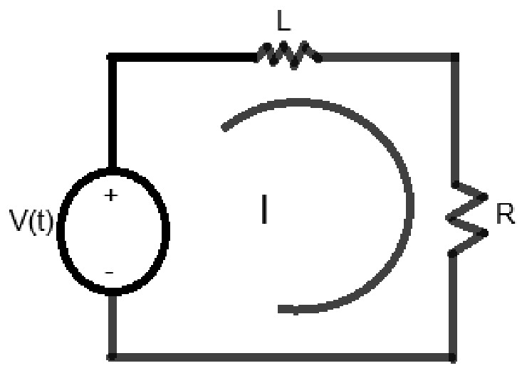

# Modelamiento  de sistemas con diagrama de bloques 
## Modelos de sistemas complejos 
- Se podrian modelar sistemas como un todo hallando las funciones de transferencia de cada componente.
- Otro enfoque es utiliza modelos ya desarrollados ampliamente para construir modelos mas complejos.

# Solenoide
Modelo del circuito electromagnetico

- Es un circuito electrico formado por un circuito electrico, un acoplamiento electromecanico y un sistema mecanico de traslacion.

$$ L\frac{di}{dt} + Ri = v(t)$$
$$ I(S) = V(s)\frac{1}{Ls+R}$$

Acople entre la parte electromagnetica y la parte mecanica 
- Ele
