# Modelamiento  de sistemas con diagrama de bloques 
## Modelos de sistemas complejos 
- Se podrian modelar sistemas como un todo hallando las funciones de transferencia de cada componente.
- Otro enfoque es utiliza modelos ya desarrollados ampliamente para construir modelos mas complejos.

# Solenoide
## Modelo del circuito electromagnetico
- Es un circuito electrico formado por un circuito electrico, un acoplamiento electromecanico y un sistema mecanico de traslacion.

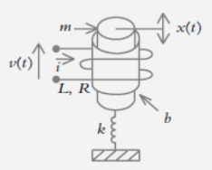

$$ L\frac{di}{dt} + Ri = v(t) $$

Trasformada de LaPlace

$$ LsI(s) + RI(s) = V(s) $$ 

$$ I(s)(L_{s}+R) = V(s) $$

$$ I(S) = V(s)\frac{1}{Ls+R} $$

Circuito 

$$ V_{L} + V_{R} = V(t) $$

Funcion de trasferencia 

$$ \frac{I(s)}{V(s)} = \frac{1}{Ls+R} $$
 
# Acople entre la parte electromagnetica y la parte mecanica 
- El electroiman produce una fuerza mecanica proporcionada a la corriente en el embobinado.

$$ f_{s} = K_{s}i $$

Trasformada de LaPlace

$$ f_{s}(s) = K_{s}I(s) $$

Funcion de trasferencia

$$ \frac{F_{s}(s)}{I(s)} = K_{s} $$

# Sistema mecanica 

- El electroiman atrae una masa acoplada por medio de un resorte y se considera el amortiguamiento dado por la envolvente de la bobina 

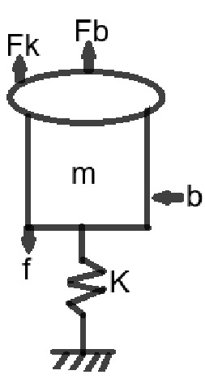

$$ m\frac{d^{2}x}{dt^{2}} + b\frac{dx}{dt} + \kappa x = f(t) $$

Trasformada de LaPlace

$$ X(s) = F(s)\frac{1}{ms^{2}+bs+\kappa} $$

Intermedio 

$$ f(t) - KX - b\dot{x} = m\ddot{x} $$

$$ F(s) - KX(s) - bsX(s) = ms^{2}X(s) $$

$$ F(s) = X(s)ms^{2} + bsX(s) + KXs) $$

$$ F(s) = X(s)(ms^{2} + bs + K) $$

## Representacion en bloque

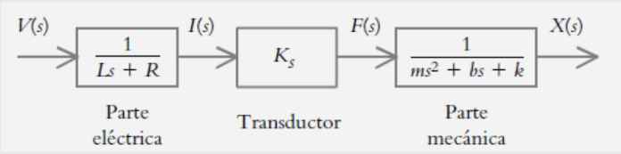

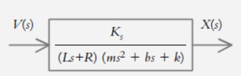

# Motor DC

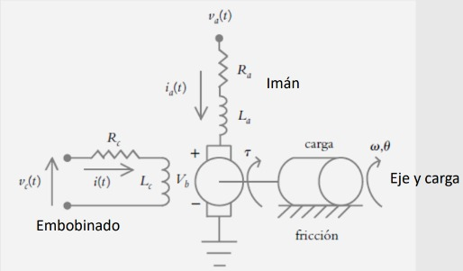

## Motor DC (Corriente de campo)
circuito elemtromagnetico

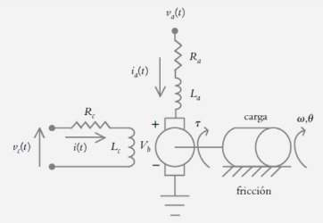

corriente de armadula es costante 

$$ i_{a} = cte$$

$$ V_{c}(t) = V_{Rc} + V_{Lc} $$

$$ V_{c}(t) = {Rc}{Lc} + L\frac{dic}{dt} $$

$$ L_{c}\frac{di_{c}}{dt} + R_{c}i_{c} = v_{c(t)} $$

Trasformada de LaPlace

$$ L_{c}(s) = V_{c}(s)\frac{1}{(sL_{C}+R_{c})} $$

Funcion de trasferencia 

$$ \frac{I_{c}(s)}{V_{c}(s)} = \frac{l}{sL_{c} + R_{c}} $$

Parte intermedia 
Como se convierte la corriente en torque que es la que provoca el movimiento del eje

- El flujo $\phi$ en el entrehierro es proporcional a la corriente de campo

$$ \phi = K_{c}i_{c} $$

- El torque desarrollado es proporcional al $$ \phi $$ y a la corriente de armadura

$$ T_{m} = K_{a}i_{a}\Phi \Rightarrow T_{m} = K_{a}i_{a}(t)K_{c}i^{c}(t) \Rightarrow T_{m} = (K_{a}K_{c}i_{a})i_{c}(t) $$

$$ T_{m}(s) = (K_{a}K_{c}I_{a})I_{c}(s) = K_{m}I_{c}(s) \Rightarrow \frac{I_{m}(s)}{I_{c}(s)} = K_{m} $$

- El torque aplicado a la carga es el desarrollado por el motor menos la inercia de la carga

$$ T_{c}(s) = T_{m}(s) - T_{p}(s) $$

- El torque aplicado (parte mecanica) a la carga se comporta como un sistema totacional clasico que considera la inercia y la friccion mecanica
Ecuancion general

$$ J\frac{d^{2}\theta }{dt^{2}}+b\frac{d\theta }{dt}+\kappa \theta = \tau (t) $$

$$ \Theta (s) = T_{c}(s)\frac{1}{(s^{2}J+bs)} $$

Funcion de trasferencia 

$$ \frac{\theta (s)}{I_{c}(s)} = \frac{1}{s^{2}J+bs} $$ 

Se puede representar de la siguiente forma 

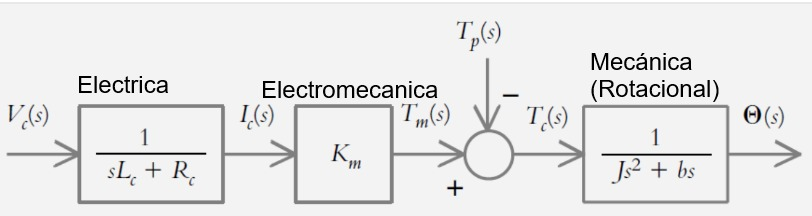

Escrita matematicamente funcion de trasferencia para el motor DC

$$ \Theta (s) = V_{c}(s)\frac{K_{m}}{(sL_{c}+R_{c})(Js^{2}+bs)} - T_{p}(s)\frac{1}{(Js^{2}+bs)} $$

$$ \frac{\Theta (s)}{V_{c}(s)} = \frac{K_{m}}{(sL_{c}+R_{c})(Js^{2}+bs)} $$

# Modelo del motor DC (Corriente de armadura)

- La corriebte de campo se asume constate por lo tanto el torque es: Parte electromecanica

$$ T_{m}(s) = (K_{a}K_{c}I_{c})I_{a}(s) = K_{m}I_{a}(s) $$

- La corriente de armadura se relaciona con el volteje aplicando a la armadura por: Parte electrica
Transformada de LaPlace de la ecuacion Diferencial

$$ V_{a}(t) = R_{a}i_{a}(t) + L_{a}\frac{di_{a}}{dt} + V_{b}(t) $$

$$ V_{a}(s) = (sL_{a} + R_{a}) I_{a}(s) + V_{b}(s) $$

Parte electrica y la parte electromecanica
- El voltaje inducido en la armadura es proporcional a la velocidad angular del eje: 

$$ V_{b}(s) = K_{b}\omega (s) $$

Se reemplaza 

$$ V_{a}(s) = (sL_{a}+R_{a})I_{a}(s)+V_{b}(s) $$

Obtenemos, ecuacion 

$$ I_{a}(s) = \frac{V_{a}(s) - K_{b}\omega (s)}{sL_{a}+R_{a}} $$

Parte mecanica
- Se comporta de la misma manera que en el caso anterior:

$$ T_{c}(s) = T_{m}(s) - T_{p}(s) $$

$$ \Theta (s) = T_{c}(s)\frac{1}{(s^{2}J+bs)} $$

## Diagrama de bloques resultalte 

$$ I_{a} = \frac{V_{a} - K_{b}\omega }{L_{s} + R_{a}} $$

$$  L(\int f(t)dt)=\frac{F(s)}{s}$$

# Elementos transmisores de energia
## Engranajes y Poleas 
- Son dispositivos mecanicos que transmiten la energia desde una parte del sistema a otra
- Los podemos usar ya sea para aumentar la cantidad de torque que se genera sobre una carga o la cantidad de velocidad 

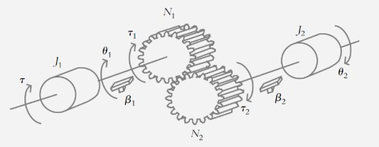

$$ \frac{\tau _{2}}{\tau _{1}} = \frac{N_{2}}{N_{1}} $$
$$ \frac{N_{2}}{N_{1}} = -\frac{\theta_{1} }{\theta_{2}} $$

## Diagrama de bloques 

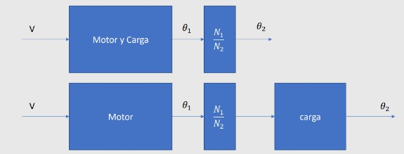

## Transmision rotacional a lineal

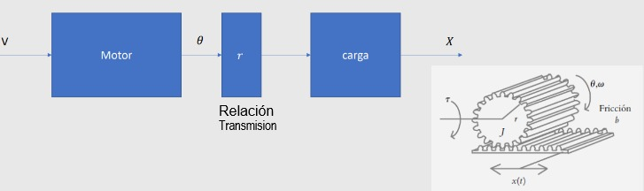

# PALANCAS

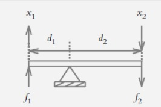

Fuerzas y distacion son constantes 

$$ -\frac{f_{2}}{f_{1}} = \frac{d_{1}}{d_{2}} $$

Distacias y desplazamiento constantes 

$$ \frac{d_{1}}{d_{2}} = \frac{x_{1}}{x_{2}} $$

# POTENCIOMETRO
## Potenciometro de rotacion 

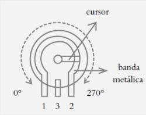

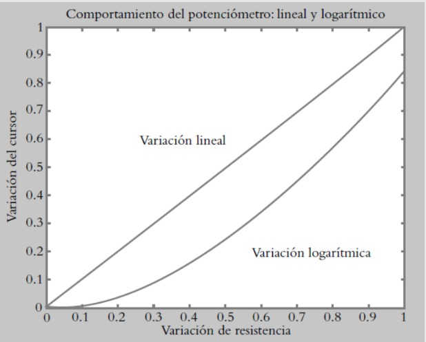

## Potenciometro lineal

$$ V_{0} = \frac{\theta }{\theta _{max}}V\propto $$

## Potenciometros logaritmicos 

$$ V_{0} = log_{10}\left ( \frac{\theta }{\theta _{Max}}V_{cc} \right) $$

## Potenciometros de translacion 

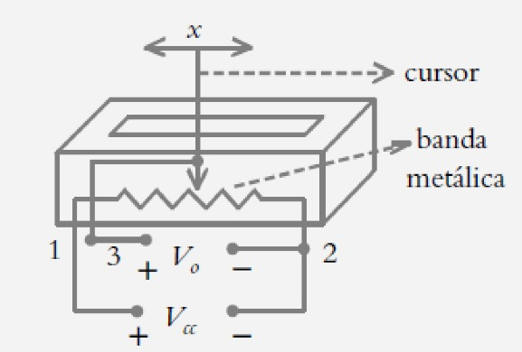

Funcion de transferencia todo va a estar a terminos de desplazamiento lineal 

$$ V_{0} = \frac{x}{x_{Max}}V_{\propto} $$

# TACOMETROS
- Son dispositivos que convierte la velocidad angular a voltaje

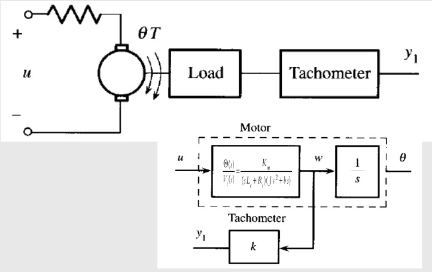

$$ v(t) = k\frac{d\theta (t)}{dt} $$

Funcion de transferencia 

$$ G(s) = \frac{V(s)}{\Theta (s)} = ks $$

# Sesores Transmisores 

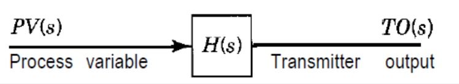

- Si son lineales
$$ H(s) = \frac{TO}{PV} = K $$

- si no son lineales, funcion de transferencia de primer grado

$$ H(s) = \frac{TO(s)}{PV(s)} = \frac{K_{T}}{\tau _{T}S+1} $$

# Modelos de otros procesos 
## Mezcla de sustancias 

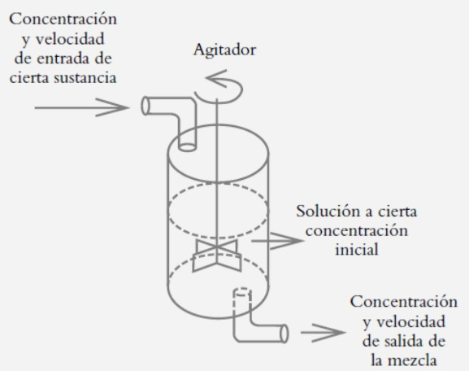

Funcion de transferencia 

$$ G(s) = \frac{Q(s)}{Q_{i}(s)} = \frac{\rho _{inicial}s+\rho _{in}v_{in}}{s+v_{out}} $$

## Ejemplo en clase
- Sea un tanque lleno con ocho litros de agua salada en el cual estan disueltos dos kg de sal. Una solucion de salmuera ( agua salada) con tres kg de sal por litro entra al tanque a una velocidad de 4l/min, mientras la mezcla bien agitada sale a la misma velocidad con la que entra.

$$ G(s) = \frac{Q(s)}{Q_{i}(s)} = \frac{2s+3*4}{s+4} $$

## Sistemas termicos

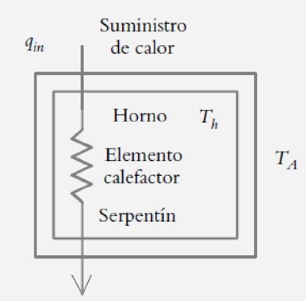

$$ G(s) = \frac{T(s)}{Q_{in}(s)} = \frac{1/C}{s+1/RC} $$

## Ejemplo en clase

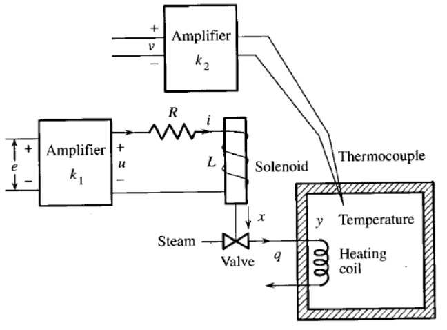

Diagrama de bloques 

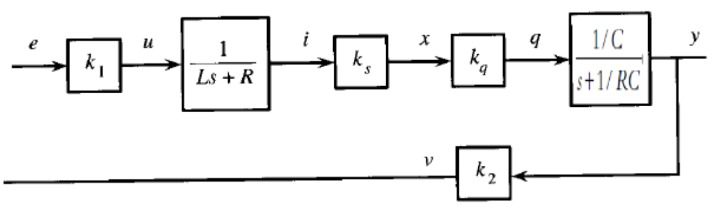

