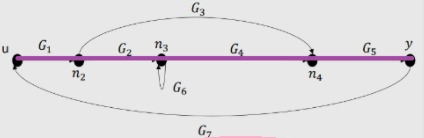

# DIAGRAMA DE FLUJO DE SEÑALES 
- Este tipo de diagrama permite otra forma de representacion de los sistemas complejos.
- Se utilizan para obtener de una manera mas sencilla la funcion de transferencia total del sistema.
## ELEMENTOS DE LOS DIAGRAMAS DE FLUJO DE SEÑAL 
- Nodo: Representan las señales de entrada o salida del sistema, se representa por medio de circulos con una etiqueta que indique el nombre de las señales.

- Flecha: Represemta la relacion entre las variables del sistema, se representa por medio de flechas que indican el sentido de la relacion, la flecha sale de una señal (Nodo) de entrada o llega a la señal de salida (Nodo), se agrega una etiqueta a la flecha para indicar la funcion de transferencia relacionada en la entrada y en la salida.

# COMPARACION DIAGRAMAS DE BLOQUES Y FLUJO DE SEÑALES 
## DIAGRAMA DE BLOQUES

## FLUJO DE SEÑALES 

#### GANANCIA DE LAZO

$$ L_{1} = G_{1}G_{2}G_{4}G_{5}G_{7} $$

$$ L_{2} = G_{1}G_{3}G_{5}G_{7} $$

$$ L_{3} = G_{6} $$

#### TRAYECTORIA DIRECTA  

$$ H_{1} = G_{1}G_{2}G_{4}G_{5} $$

$$ H_{2} = G_{1}G_{3}G_{5} $$

## DEFINICIONES 
- Camino o trayectoria: Camino o trayacto es un recorrido de ramas conectadas en el sentido de las flechas de las ramas.
- Si no se cruza ningun nodo mas de una vez, el camino o trayectoria es abierto.
- Si el camino o trayectoria finaliza en el mismo nodo del cual partio y no cruzan otro mas de una vez, es un camino o trayecto cerrado.
- Ganancia de lazo: La ganancia de lazo es el producto de las ganancias de ramas de un lazo.
- Ganancia de trayecto directo: La ganancia de trayecto directo es el producto de las ganancias de rama de un camino o trayecto directo.
- Trayecto o camino directo: Trayecto directo es el camino o trayecto de un nodo de entrada a un nodo de salida, sin cruzar ningun nodo mas de una vez.
- Lazo: Una lazo es un camino o trayecto cerrado
# FORMULA DE MANSON

$$ P = \frac{1}{\Delta }\sum_{k}P_{k}\Delta _{k} $$

- $$P_{k}$$ = Ganancia de los caminos
- $$\Delta$$ = 1 - (suma ganancias de los lazos) + (suma producto de 2 lazos que no se tocan) - (suma producto de 3 lazos que no se tocan) + .................
- $$\Delta_{k}$$ = 1 - (suma ganancia lazos que no toquen la trayectoria $$P_{k}$$ y no se toquen entre si) + (suma ganancia 2 lazos que no toquen la trayectoria $$P_{k}$$ y no se toquen entre si ) - (suma ganancia 3 lazos que no toquen la trayectoria $$P_{k}$$ y no se toquen entre si) + .......................
- k = Numero de trayectoria directa
## EJEMPLO DE CLASE
1.

#### TRAYECTORIA DIRECTA:

$$ P_{1} = 1 * 1 * G_{1} * G_{2} * G_{3} * 1 = G_{1}G_{2}G_{3} $$

#### LAZOS CERRADOS: 

$$ L_{1} = G_{1}G_{2}H_{1} $$

$$ L_{2} = -G_{2}G_{3}H_{2} $$

$$ L_{3} = -G_{1}G_{2}G_{3} $$

#### DETERMINANTE:

$$ \Delta = 1 - (L_{1} + L_{2} + L_{3}) $$

#### COFACTORES:

$$ \Delta_{1} = 1 $$ 

$$ \frac{C(s)}{R(s)} = \frac{P_{1}\Delta_{1}}{\Delta} = \frac{G_{1}G_{2}G_{3}}{1 - G_{1}G_{2}H_{1} + G_{2}G_{3}H_{2} + G_{1}G_{2}G_{3}} $$

2.

#### TRAYECTORIA DIRECTA:

$$ P_{1} = G_{1}G_{2}G_{3}G_{4}G_{5} $$

$$ P_{2} = G_{1}G_{6}G_{4}G_{5} $$

$$ P_{3} = G_{1}G_{2}G_{7} $$

#### LAZOS CERRADOS:

$$ L_{1} = -G_{4}H_{1} $$

$$ L_{2} = -G_{2}G_{7}H_{2} $$

$$ L_{3} = -G_{6}G_{4}G_{5}H_{2} $$

$$ L_{4} = -G_{2}G_{3}G_{4}G_{5}H_{2} $$

#### DETERMINANTE:

$$ \Delta = 1 - (L_{1} + L_{2} + L_{3} + L_{4}) + L_{1}L_{2} $$

#### COFACTORES:

$$ \Delta_{1} = 1 $$

$$ \Delta_{2} = 1 $$

$$ \Delta_{3} = 1 - L_{1} $$

$$L_{1}$$  no toca la trayectoria

$$ \frac{C(s)}{R(s)} = \frac{1}{\Delta}(P_{1}\Delta_{1} + P_{2}\Delta_{2} + P_{3}\Delta_{3} ) = \frac{G_{1}G_{2}G_{3}G_{4}G_{5} + G_{1}G_{6}G_{4}G_{5} + G_{1}G_{2}G_{7}(1 + G_{4}H_{1})}{1 - G_{4}H_{1} + G_{2}G_{7}H_{2} + G_{6}G_{4}G_{5}G_{2}H_{2} + G_{4}H_{1}G_{2}G_{7}H_{2}} $$

3.

#### TRAYECTORIA DIRECTA:

$$ P_{1} =1 * G_{1} * 1 * G_{2} * 1 * G_{3} * 1 * G_{4} $$  

$$ P_{1} = G_{1}G_{2}G_{3}G_{4} $$

#### LAZOS CERRADOS:

$$ L_{1} = -G_{1}G_{2} $$

$$ L_{2} = -G_{3}G_{4} $$

$$ L_{3} = G_{2}G_{3} $$

#### DETERMINANTE:

$$ \Delta = 1 - (L_{1} + L_{2} + L_{3}) + L_{1}L_{2} $$

#### COFACTORES:

$$ \Delta_{1} = 1 $$

$$\frac{E(0)}{E(1)} = \frac{G_{1}G_{2}G_{3}G_{4}}{1 + G_{1}G_{2}G_{3}G_{4} + G_{1}G_{2}G_{3}G_{4}G_{5}} $$

## EJEMPLO DE TEMA 
1.

Pasar un diagrama de bloques a una grafica de flujos de señales 

#### LAZOS CERRADOS:

$$ L_{1} = -G_{1}H_{2} $$

$$ L_{2} = -G_{2}H_{1} $$

$$ L_{3} = G_{3}H_{1}H_{2} $$

#### TRAYECTORIA DIRECTA:

$$ P_{1} = G_{1}G_{2} $$

$$ P_{1} = G_{1}G_{2} $$

$$ P_{1} = G_{1}G_{2} $$

#### DETERMINANTE:

$$ \Delta = 1 - (L_{1} + L_{2} + L_{3}) = 1 - ( - G_{1}H_{2} - G_{2}H_{1} + G_{3}H_{1}H_{2}) = 1 + G_{1}H_{2} + G_{2}H_{1} - G_{3}H_{1}H_{2} $$

#### COFACTORES:

$$ \Delta_{1} = 1 $$

$$ \Delta_{2} = 1 - L_{1} = 1 + G_{1}H_{2} $$

### FUNCION DE TRANSFERENCIA 

$$ G(s) = \frac{G_{1}G_{2} + G_{4} + G_{1}G_{4}H_{2} + G_{3}}{1 + G_{1}H_{2} + G_{2}H_{1} - G_{3}H_{1}H_{2}} $$

2.

Pasar un diagrama de bloques a una grafica de flujos de señales 

#### LAZOS CERRADOS:

L_{1} = \frac{ - 16k}{s + 0.8}

L_{2} = \frac{ - 16}{(s + 0.8)s}

#### TRAYECTORIA DIRECTA:

T_{1}=\frac{16}{(s+0.8)s}

#### DETERMINANTE:

\Delta = 1 - L_{1} - L_{2} = 1 + \frac{16k}{s + 0.8} + \frac{16}{(s + 0.8)s}

\Delta = \frac{(s + 0.8)s + 16ks + 16}{(s + 0.8)s} = \frac{s^{2} + (16k + 0.8)s + 16}{(s + 0.8)s}

#### COFACTORES:

\Delta_{1} = 1

### FUNCION DE TRANSFERENCIA 

G(s) = \frac{16}{s_{2} + (16k + 0.8)s + 16}

