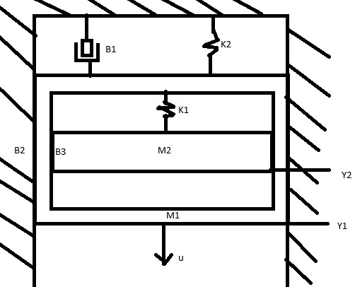
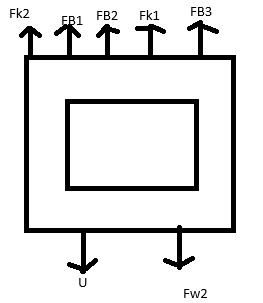
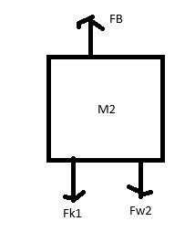
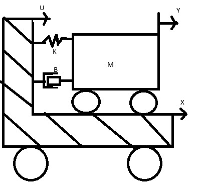
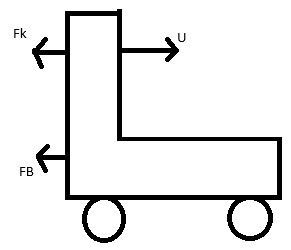
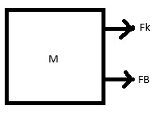
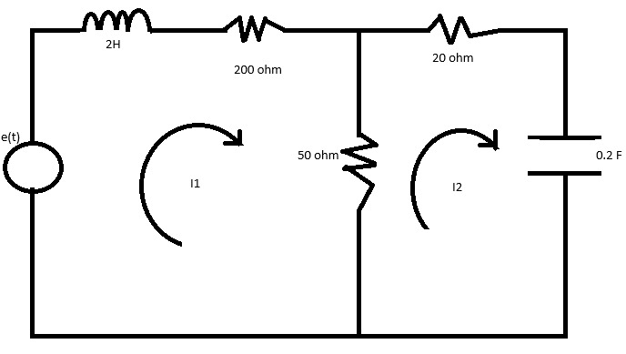

# Correcion Parcial 2do corte
Valentina Riveros Feria, Angel David Melo, Daniel Felipe Ladino 

## 1. Sistema mecanico #1

M1:

$$u(t)+F_{w1}-F_{k2}-F_{B1}-F_{B2}-F_{B3}-F_{k1}=m_{1}a_{m1}$$

$$u(t)+m_{1}g-k_{1}y_{1}-B_{1}Y_{1}'-B_{2}Y_{2}'-B_{3}(Y_{1}'-Y_{2})-K_{2}(Y_{1}-Y_{2})=m_{1}Y_{1}''$$

M2:

$$F_{k1}-F_{w2}-F_{B3}=m_{2}a_{m2}$$

$$K_{1}(y_{1}-y_{2})+m_{2}g-B_{3}(y_{1}'-yu_{2}')=m_{2}y_{2}''$$

## 2. Sistema mecanico #2

Modelamiento del carro:

$$U(t)-F_{x}-F_{B}=0$$

$$U(t)-K(y-x)-B(y'-x')=0$$

Modelamiento masa:

$$F_{k}+F_{B}=Ma_{m}$$

$$K(y-x)+B(y'-x')=My''$$

## Sistema electrico

Modelamiento en terminos de voltaje

$$-e(t)+V_{L}+V_{200}+V_{50}=0$$

$$-e(t)+2I_{1}'+200I+50(I_{1}-I_{2})=0$$

$$50(I_{2}-I_{1})+20I_{2}+\frac{1}{c}\int I_{2}dt=0$$

Modelamiento en terminos de corriente:

$$I_{1}-I_{2}-I_{3}=0$$

$$I_{1}-0.2V_{c}'-\frac{V_{x}}{50}=0$$

$$V_{x}=20I_{2}+V_{c}$$

$$V_{x}=4V_{e}'+V_{c}$$

$$e(t)=LI_{1}'+200I_{1}+V_{x}$$

$$I_{c}=0.2V_{c}'$$
