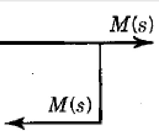

# Algebra de bloques
Diagrama de bloques
- Una herramienta que puede ayudar a entender un poc la interaccion entre varios sistemas son los diagramas de bloques.
- Primer sistema de control J.Watt.
- Para explicar su sistemas empezo a desarrollar los diagramas de bloques.
## Maquina de vapor

# Elementos de un diagrama de bloques 
- Bloque funcional: Es un simbolo para representar la operacion matematica que sobre la señal de entrada hace el bloque para producir una salida.

- Flechas: Representa las señales que se estan moviendo dentro del proceso, la señal solo puede pasar en la direccion de las flechas y son magnitudes fisicas. La punta de la flecha quie señala el bloque indica una entrada, la punta de la flecha que se aleja del bloque indica salida.

-Punto suma: Realiza operaciones (Suma o resta) entre señales unicamente. el signo mas o el signo menos en cada punta de la flecha, indica si la señal debe sumarse o restarse.

-Ramificacion: Un punto de ramificacion es aquel que apartir del cual la señal de un bloque va de modo concurrente a otros bloques o puntos de suma.

## Interpretacion del diagrama
- La salida de un bloque funcional corresponde a la señal de entrada (Dominios) multiplicada por la funcion de transferencia del bloque. 

$$ Y(s) = U(s) * G(s) $$

Funcion de transfetencia

$$ \frac{Y(s)}{U(s)} = G(s) $$

## Aplicacion de una diagrama de bloques 
CSTR = Continuos Stirred Tank Reactor = Tanque Reactor de Agitacion Continua, tanque donde se juntan varias sustancias y sale sola una sustancia.

# Ejemplo de clase
## Bloques en cascada
1.
- Si se tienen 2 sistemas interconectadas.
  

$$ Y_{1}(s) = U_{1}(s)G_{1}(s) $$
 
$$ Y_{2}(s) = U_{2}(s)G_{2}(s) $$
 
Sustituimos
 
$$ Y_{2}(s) = Y_{1}(s)G_{2}(s) $$
 
$$ Y_{2}(s) = U_{1}(s)G_{1}(s)G_{2}(s) $$

$$ \frac{Y_{2}(s)}{U_{1}(s)} = G_{1}(s)G_{2}(s) $$

2.
- Identificar los elementos de Sistema de la figura.

Tipos de elementos 
- Punto suma
- Bloque funcional
- Flechas (Señales)
- Ramificacion 

## Algebra de bloques 
Utilizando algebra de bloques es posibles obtener la funcion de transferencia de sistemas compuestos de varios bloques funcionales.

Reglas
1. Un punto suma varias entadas en los mismo que separarlos en varios puntos suma, no reduce el diagrama pero si premite organizarlo.
2. Si de un punto de ramificacion salen varias señales es lo mismo separar en varios puntos de ramificacion siempre y cuandra esa la misma señal.
3. 4. 5. 6. No reduce el diagrama de bloque pero si permiten tranformar reglas que si los reduscan
7. 8. 9. Esas si permiten reducir el diagrama de bloques
9. Regla de retroalimentacion y de reducion 

Matematicamente para la regla 8 

Ecuaciones 

$$ Y_{1} = UG_{1} $$

$$ Y_{2} = UG_{2} $$

Puntos suma

$$ Y = Y_{1}+Y_{2} $$

Reemplaza 

$$ Y = UG_{1}+UG_{2} $$

Fractorizar 

$$ Y = U(G_{1}+G_{2}) $$

$$ \frac{Y}{U} = G_{1}+G_{2} $$

# Demostracion propiedades 
## Lazo de realimentacion positivo 
## Ejemplo de clase

Punto Suma 

$$ E(s) = X(s) + Y_{1}(s) $$

Ecuacion para el bloque funcional 

$$ Y(s) = E(s)G_{1}(s) $$

$$ Y_{1}(s) = Y(s)G_{2}(s) $$

Sustituyendo 1 en 2

$$ Y(s) = (X(s) + Y_{1}(s))G_{1}(S) $$

$$ Y(s) = (X(s) + Y(s)G_{2}(s))G_{1}(S) $$

$$ Y(s) = (X(s)G_{1}(s) + Y(s)G_{2}(s)G_{1}(s)) $$

$$ Y(s) - Y(s)G_{2}(s)G_{1}(s) = (X(s)G_{1}(s)) $$

$$ Y(s)(1 - G_{2}(s)G_{1}(s)) = (X(s)G_{1}(s)) $$

Funcion de transferecia 

$$ \frac{Y(s)}{X(s)} = \frac{G_{1}(s)}{1 - G_{2}(s)G_{1}(s)} $$

## Lazo de realimentacion negativa 
Es lo mismo que la positiva pero solamente cambia el signo.

Punto Suma 

$$ E(s) = X(s) - Y_{1}(s) $$

Ecuacion para el bloque funcional 

$$ Y(s) = E(s)G_{1}(s) $$

$$ Y_{1}(s) = Y(s)G_{2}(s) $$

Sustituyendo 1 en 2

$$ Y(s) = (X(s) - Y_{1}(s))G_{1}(S) $$

$$ Y(s) = (X(s) - Y(s)G_{2}(s))G_{1}(S) $$

$$ Y(s) = (X(s)G_{1}(s) - Y(s)G_{2}(s)G_{1}(s)) $$

$$ Y(s) + Y(s)G_{2}(s)G_{1}(s) = (X(s)G_{1}(s)) $$

$$ Y(s)(1 + G_{2}(s)G_{1}(s)) = (X(s)G_{1}(s)) $$

Funcion de transferecia 

$$ \frac{Y(s)}{X(s)} = \frac{G_{1}(s)}{1 + G_{2}(s)G_{1}(s)} $$

# Reduccion de diagramas 
## Aplicacion algebra de bloques 
# Ejemplo de clase
- Hallar la funcion de transferencia $ \frac{Y(s)}{X_{1}(s)} y \frac{Y(s)}{X_{2}(s)} $

Reducion 

Funciones de transferencia 

$$ \frac{Y(s)}{X_{1}(s)} = G_{3}(G_{1}-G_{2}) $$

$$ \frac{Y(s)}{X_{2}(s)} = (G_{4}-1) $$

2.
-Hallar la funcion de transferencia $ \frac{C(s)}{R(s)} $

F

